# QGroundControl Ground Control Station

*QGroundControl* (QGC) is an intuitive and powerful ground control station (GCS) for UAVs.

The primary goal of QGC is ease of use for both first time and professional users.
It provides full flight control and mission planning for any MAVLink enabled drone, and vehicle setup for both PX4 and ArduPilot powered UAVs. Instructions for *using QGroundControl* are provided in the [User Manual](https://docs.qgroundcontrol.com/en/) (you may not need them because the UI is very intuitive!)

All the code is open-source, so you can contribute and evolve it as you want.
The [Developer Guide](https://dev.qgroundcontrol.com/en/) explains how to [build](https://dev.qgroundcontrol.com/en/getting_started/) and extend QGC.

## Developer environment setup
- Download [Qt online installer](https://www.qt.io/download)
- Run the installer and install Qt 5.15.2 with MSVC 2019 64 bit, Android and Qt charts

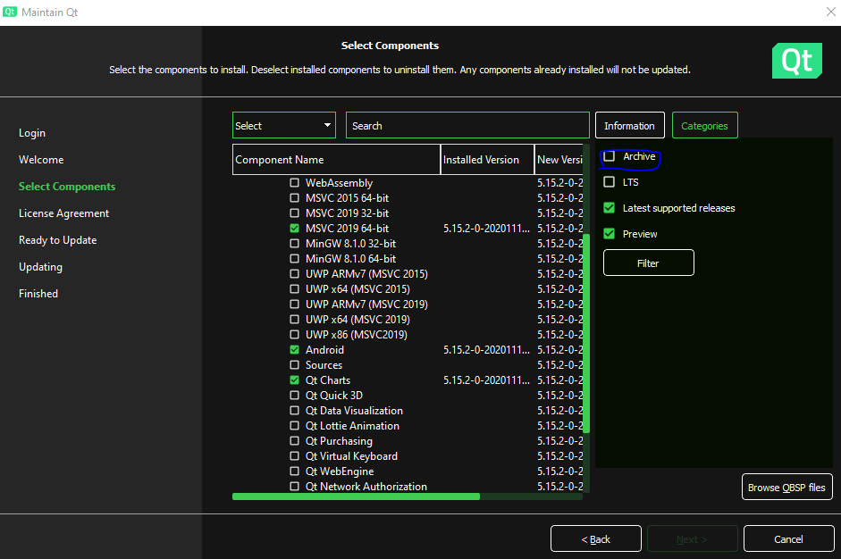

If Qt 5.15.2 doesn't appear check Archive option and click on Filter to load it

- Launch Qt creator when setup finished
- Open your project (qgroundcontrol.pro)
- Optional : install [Gstreamer 1.8.1](https://gstreamer.freedesktop.org/data/pkg/windows/1.8.1/)

## Build
### Windows
- Choose Desktop Qt 5.15.2 MSVC2019 64bit in Projects tab

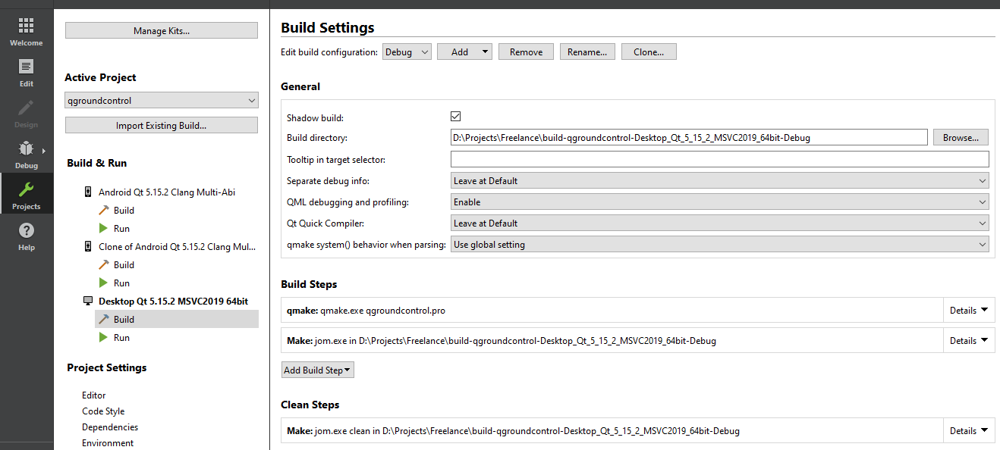

- Then Build and Run

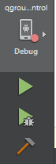

### Android
- Install [Java 11](https://adoptium.net/temurin/releases/?version=11)
- Install [Android studio](https://developer.android.com/studio)
- Go to SDK manager

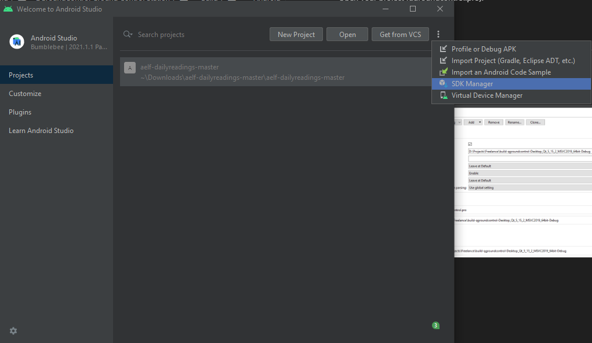

- Go to SDK tools

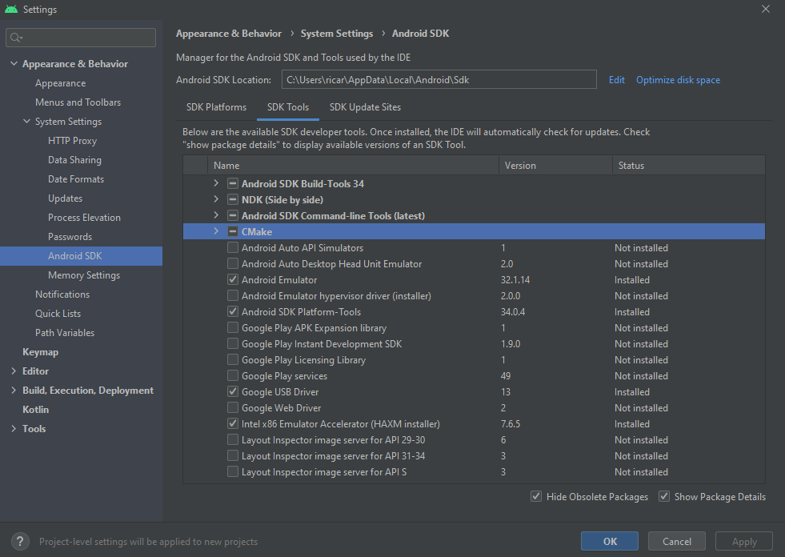

- Choose NDK 21 by checking *Show Package DETAILS* and clicking on *NDK (Side by side)*

 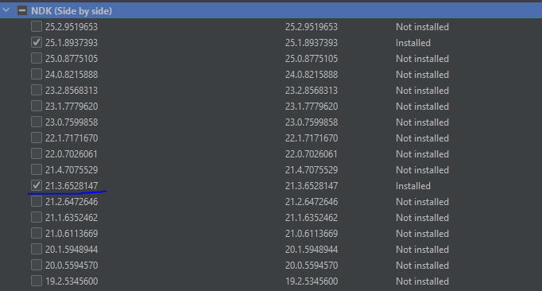

- Note Android SDK Location

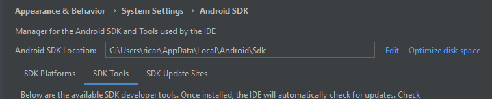

- Click on Apply and OK  
- Go to Qt *Creator > Projects*
- Click on *Manage Kits* and go to *Devices > Android*

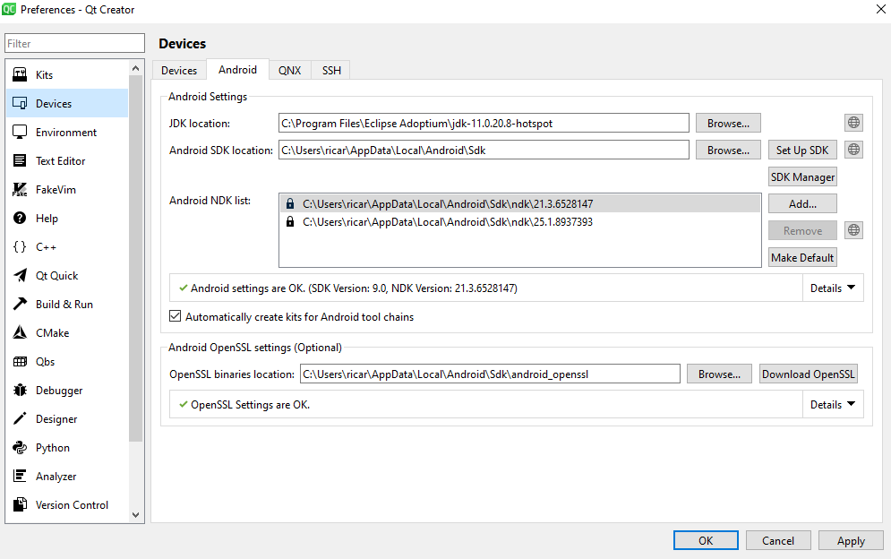

- Fill the fields correctly : previous installed java and Sdk paths. Ndk path is under SDk's and the folder's name contains NDK's version. OpenSSL path is generated automatically, otherwise click on *Download OpenSSL*.
- Click on *Apply*.
- Sometimes after clicking on *Apply* Qt asks you to install new version of NDK. Just allow it. Your primary used NDK will remain 21 as configured in SDK manager.
- Click on *OK*.
- Now add *Android Qt 5.15.2 Clang Multi-Abi* in *Build & Run* section.

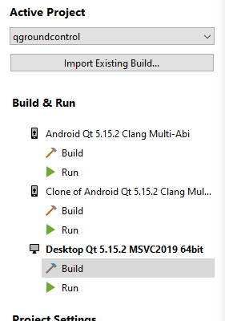

- Or Add it by clicking on *Import Existing Build*
- If having some troubles to import it Go to *Manage Kits > Kits* to configure this kit.

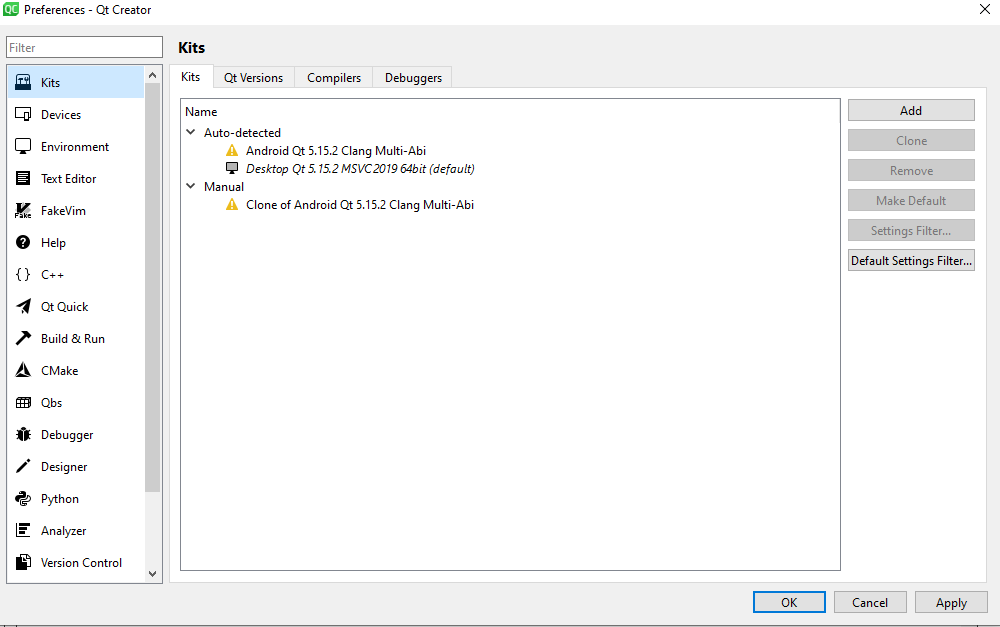

- When the kit is added, Click on *Build* and go to *Build Steps*
    - in *qmake* section choose *armeabiv7a* as ABI.

     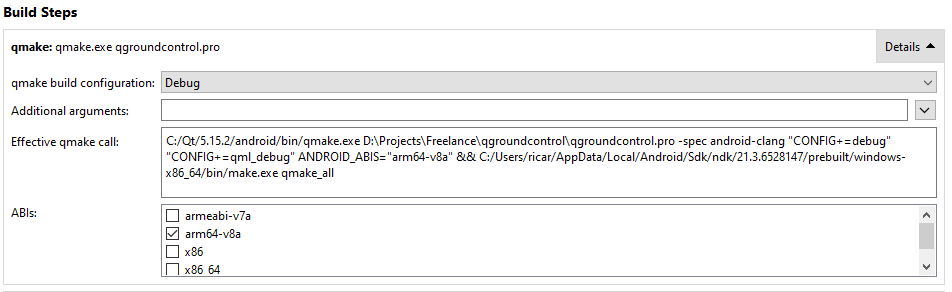

     - in *Build Android APK*, choose Android appropriate *build-tools version* and *build platform SDK*.

     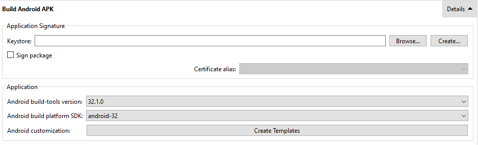

- Then Build and Run.

- Apk will be generated in build-qgroundcontrol-Android_Qt_5_15_2_Clang_Multi_Abi-Debug\android-build\build\outputs\apk\debug\android-build-debug.apk.  

Key Links:
* [Website](http://qgroundcontrol.com) (qgroundcontrol.com)
* [User Manual](https://docs.qgroundcontrol.com/en/)
* [Developer Guide](https://dev.qgroundcontrol.com/en/)
* [Discussion/Support](https://docs.qgroundcontrol.com/en/Support/Support.html)
* [Contributing](https://dev.qgroundcontrol.com/en/contribute/)
* [License](https://github.com/mavlink/qgroundcontrol/blob/master/COPYING.md)
* [Qt for Android](https://doc.qt.io/qt-5/android-getting-started.html)
